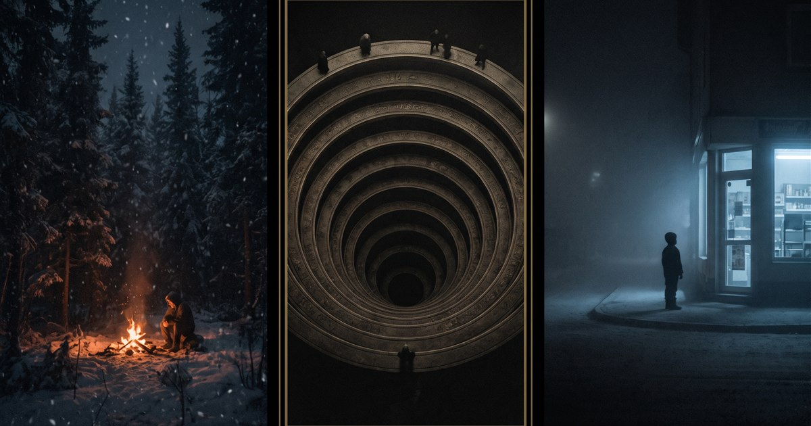

# THE SHELF — *three ways to lose yourself*

**▶ https://kylefriesmarketing.github.io/games/**

A trilogy of branching-story games. Same bones — vanilla JS, zero dependencies, all-static,
generative audio, everything data-driven — three very different nightmares. No installs, no
accounts, nothing but choices and their consequences.

| | Game | One line |
|---|---|---|
| 🔥 | **[Still Breathing](https://kylefriesmarketing.github.io/still-breathing/)** | A survival thriller built from four true ordeals — every deadly choice is a real survival myth. |
| ⭕ | **[Nine Circles](https://kylefriesmarketing.github.io/nine-circles/)** | A descent through Dante's Hell with a dead poet. Carry three names. Keep the star lit. |
| 🚪 | **[Choose Wisely](https://kylefriesmarketing.github.io/choose-wisely/)** | A corner shop with five aisles and forty-one endings. The shop remembers you between visits. |

Each game's source lives in its own repo:
[still-breathing](https://github.com/kylefriesmarketing/still-breathing) ·
[nine-circles](https://github.com/kylefriesmarketing/nine-circles) ·
[choose-wisely](https://github.com/kylefriesmarketing/choose-wisely)
