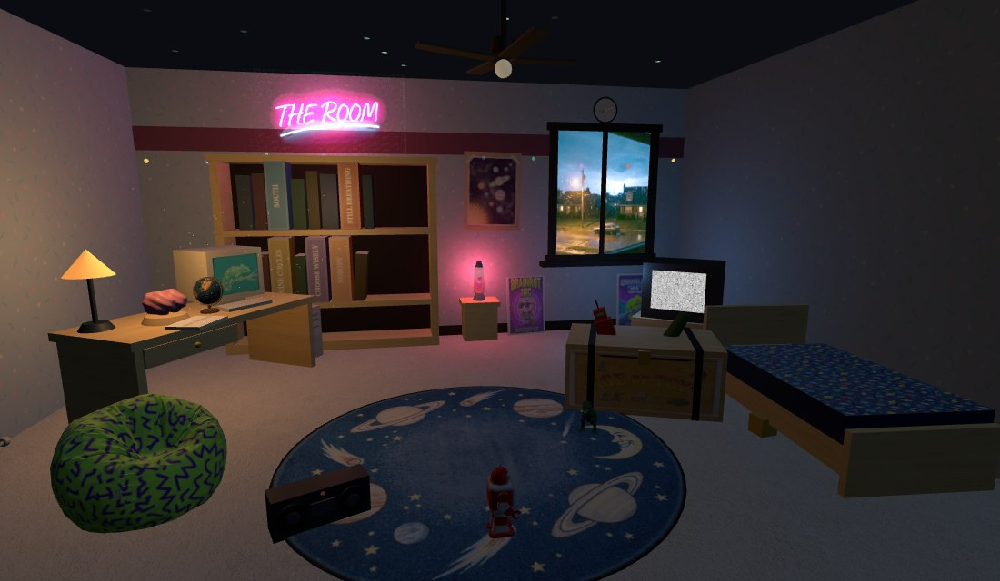

# THE ROOM

**A 90s bedroom you can click. Every object is a doorway.**

**▶ Play it: https://kylefriesmarketing.github.io/games/**



It's after bedtime. Rain on the window, cartoons flickering on the CRT, a lava lamp
doing its slow thing, and a wind-up robot making laps around the galaxy rug. Everything
in the room is real and everything is clickable:

| In the room | What it opens |
|---|---|
| **The bookshelf** — five books standing proud of the row | [CHOOSE WISELY](https://kylefriesmarketing.github.io/choose-wisely/) · [NINE CIRCLES](https://kylefriesmarketing.github.io/nine-circles/) · [STILL BREATHING](https://kylefriesmarketing.github.io/still-breathing/) · [SOUTH](https://kylefriesmarketing.github.io/south/) · [NOBODY](https://kylefriesmarketing.github.io/nobody/) |
| **The toy chest** — it smolders while a campaign is underway | [AGE OF TOYS](https://kylefriesmarketing.github.io/toybox-tactics/) — a storybook RTS |
| **The army men on the rug** — frozen mid-battle, until you look | the same war, up close; hover and they waddle, muzzles flashing |
| **The beige PC** and **the brain on the desk** | CHAMELEON 3D and BRAINROT INC — coming soon (the PC runs a screensaver if you poke it) |
| **The notebook** | a real multi-page notebook: endings found, the campaign act by act, your lifetime war record |
| **The TV** | the channel guide (plain list view, with your progress on each spine) |
| **The boombox** | a composed lofi tape under the rain — no audio files, all synthesized |
| **The tin robot** | click to wind his key: a burst of speed, and he changes his mind about direction |
| **The bed** | "five more minutes" — the lights ease down, somebody snores, the robot tiptoes |
| The lamp, the clock, the door... | the room minds its own business (though once a night, somebody knocks) |

The clock on the wall shows *your* actual time — and the room follows it. Come by on
a gray afternoon and the window is bright; around seven the last warm light leans in;
after bedtime it's the classic blue; and in the dead of night the rain doubles down,
the glow stars burn brightest, and the cartoons give way to a test pattern. Lightning
flashes first, thunder arrives when the distance allows. The calendar has opinions
too: December hangs red-green-gold lights and a paper snowflake, the last week of
October runs slime in the lava lamp under pumpkin lights, and every July 11 — the day
the room first opened — a crayon banner goes up over the shelf. Tab walks the room on
a keyboard; Enter opens what you've landed on. The whole thing is Three.js —
primitives, generated textures, four AI-generated props (beanbag, T-rex, skateboard,
globe) and one patrolling tin robot — no build step, no framework, one HTML file and
one script.

## Running locally

Serve the repo root with any static server and open `index.html`. The 3D room needs
WebGL; without it (or via the LIST VIEW button) you get the plain shelf list.

```
node tools/check-room.js   # audits every asset reference against disk
```

## The idea

One room, every game on the shelf, more games arriving as cartridges, posters, and
toys as they're built. Built by [Kyle Fries](https://github.com/kylefriesmarketing)
with Claude.
